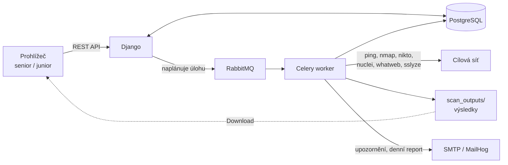

# Webová aplikace pro orchestraci skenů zranitelností

Webová aplikace pro správu zranitelností. Plánuje pravidelné skeny sítí nebo jednotlivých serverů, spouští sadu bezpečnostních nástrojů (nmap, nikto, nuclei, whatweb, sslyze), ukládá výsledky a posílá e-mailová upozornění.

## Co umí

- naplánovat sken podle cronu (`IP + prefix` nebo DNS jméno),
- najít živé adresy v síti a každou naskenovat všemi nástroji,
- měsíční kalendář naplánovaných skenů,
- upravit přezdívku a rozvrh testu, zapnout nebo vypnout plánování,
- automatické opakování při selhání,
- e-maily při nálezu zranitelnosti, změně živých IP a selhání skenu, denní report v 8:00,
- stažení posledního výsledku testu nebo ZIP archivu podle data,
- role **senior** (vše) a **junior** (jen prohlížení a stahování).

## Technologie

Django 5.2, Django REST Framework, Celery + RabbitMQ, django-celery-beat, PostgreSQL, Bootstrap 5 (jedna stránka s vanilla JS).

## Požadavky

Linux (vyvíjeno na Kali) s nainstalovanými: PostgreSQL, RabbitMQ, Python 3, nmap, nikto, nuclei, whatweb, sslyze a (pro vývoj) MailHog.

## Instalace

Skript `setup_kali_env.sh` musí ležet **nad** adresářem repozitáře (repozitář se očekává v `~/sec_instrument`). Nainstaluje závislosti, vytvoří virtuální prostředí a databázi.

```bash
cp setup_kali_env.sh ..        # skript patří o úroveň výš
cd .. && bash setup_kali_env.sh
```

## Konfigurace

Nastavení se čte z `.env` v kořeni projektu.

| Proměnná | Povinná | Výchozí | Popis |
|---|:---:|---|---|
| `DJANGO_SECRET_KEY` | ano | | tajný klíč Djanga |
| `DB_PASSWORD` | ano | | heslo k PostgreSQL |
| `RABBITMQ_PASSWORD` | ano | | heslo k RabbitMQ |
| `SCAN_NOTIFICATION_EMAIL` | ano | | adresa pro upozornění |
| `DJANGO_ALLOWED_HOSTS` | | prázdné | hostitelé oddělení čárkou |
| `DB_NAME`, `DB_USER`, `DB_HOST`, `DB_PORT` | | `sec_instrument_db`, `kali`, `localhost`, `5432` | PostgreSQL |
| `RABBITMQ_USER`, `RABBITMQ_HOST`, `RABBITMQ_PORT` | | `kali`, `localhost`, `5672` | RabbitMQ |
| `EMAIL_HOST`, `EMAIL_PORT`, `DEFAULT_FROM_EMAIL` | | `localhost`, `1025`, `noreply@sec_instrument.local` | SMTP (MailHog) |

## Spuštění

```bash
./start_services.sh        # PostgreSQL, RabbitMQ, MailHog, Celery worker a beat, runserver
./start_services.sh --bg   # totéž, runserver na pozadí
./stop_services.sh         # zastavení
```

Aplikace poběží na `http://127.0.0.1:8000/`, zachycené e-maily na `http://127.0.0.1:8025/`.

První spuštění:

```bash
python manage.py migrate
python manage.py createsuperuser
```

Uživatele pak v administraci (`/admin/`) zařaďte do skupiny `senior` nebo `junior` (skupiny vytvoří migrace).

## Rychlé použití

1. Přihlaste se na `/login/`.
2. V kartě **Input** zadejte IP a prefix (nebo DNS jméno) a cron, například `0 2 * * *`, a klikněte na **Submit**.
3. V tabulce **Data - Tests** sledujte `Next Scheduled` a `Last Test`.
4. Výsledek stáhnete tlačítkem **Download** u řádku, archiv podle dat kartou **Download**.


## Struktura

```text
backend/     skenovací úlohy, plánovač, signály, modely LogScan a LogScanRetry
frontend/    REST API, modely Test a TestIP, serializér, oprávnění
templates/   hlavní stránka a přihlášení
sec_instrument/  nastavení Djanga a Celery
scan_outputs/    výsledky skenů (vzniká za běhu, není v gitu)
```


(images/kalendar_velky.png)
(images/kalendar_maly.png)
(images/input_download_display)

## Logy

Soubory v `logs/`: `django.log`, `django_errors.log`, `celery.log`, `scans.log`, `celery_worker.log`.

## Upozornění

Skenujte pouze systémy, které vlastníte nebo k nimž máte písemné oprávnění.


Podrobná technická dokumentace a uživatelská příručka jsou v Projectu (`sec_instrument_dokumentace.md`, `sec_instrument_uzivatelska_prirucka.md`).setup_kali_env.sh musi byt nad repem
